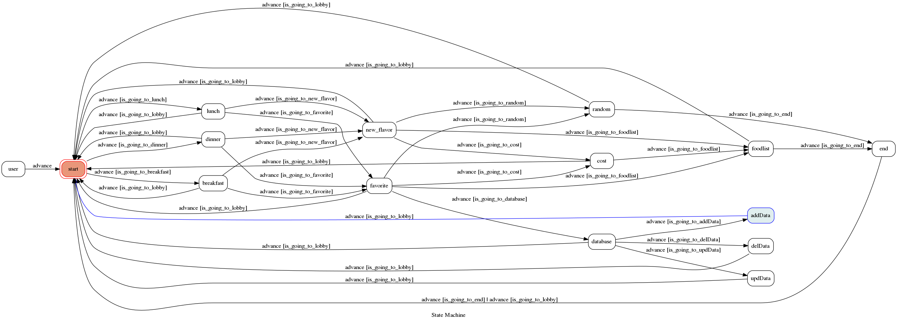

# TOC Project 2020

[](https://codeclimate.com/github/NCKU-CCS/TOC-Project-2020/maintainability)

A Line bot based on a finite state machine

## Setup

### Prerequisite
* Python 3.6
* Pipenv
* Facebook Page and App
* HTTPS Server
* Firebase

#### Install Dependency
```sh
pip3 install pipenv

pipenv --three

pipenv install

pipenv shell

pip install firebase-admin
```


#### Secret Data
You should generate a `.env` file to set Environment Variables.
`LINE_CHANNEL_SECRET` and `LINE_CHANNEL_ACCESS_TOKEN` **MUST** be set to proper values.
Otherwise, you might not be able to run your code.

#### Run Locally
You can either setup https server or using `ngrok` as a proxy.

#### a. Ngrok installation
* [ macOS, Windows, Linux](https://ngrok.com/download)

**`ngrok` would be used in the following instruction**

```sh
ngrok http 8000
```

After that, `ngrok` would generate a https URL.

#### Run the sever

```sh
python3 app.py
```

#### b. Servo

Or You can use [servo](http://serveo.net/) to expose local servers to the internet.


## Finite State Machine


## Usage
The initial state is set to `user`.

Every time `user` state is triggered to `advance` to another state, it will `go_back` to `user` state after the bot replies corresponding message.

* user
	* Input: anykey		
	* Destination: `Start`
	* Description: The user state will go to the Start state whenever you input
	
* Start
	* Input: 早餐，午餐，晚餐
	* Destination: `breakfast`,`lunch`,`dinner`
	* Description: Choose one selection for advanced suggestion

* breakfast,lunch,dinner
	* Input: 試試新口味，最愛
	* Destination: `new_flavor`,`favorite`
	* Description: user can pick whether you want to choose a new thing for your food or pick from your favorite list

* new_flavor,favorite
	* Input: 隨機，價位
	* Destination: `random`,`cost`
	* Description: if you are lazy to choose some food, you can just go ahead random option to let our line-bot give you an answer.Or you can go with cost conditions
	
* cost,new_flavor,favorite
	* Input: 產生美食菜單
	* Destination: `foodlist`
	* Description: ask the line-bot to create a food list with the given conditions

* end
	* Input: 確定
	* Destination: `Start`
	* Description: If you decided your food to have, click 確定 to go back lobby
	
* back
	* Input: 返回大廳
	* Destination: `Start`
	* Description: go back to lobby immediately
		
## Deploy
Setting to deploy webhooks on Heroku.

### Heroku CLI installation

* [macOS, Windows](https://devcenter.heroku.com/articles/heroku-cli)

or you can use Homebrew (MAC)
```sh
brew tap heroku/brew && brew install heroku
```

or you can use Snap (Ubuntu 16+)
```sh
sudo snap install --classic heroku
```

### Connect to Heroku

1. Register Heroku: https://signup.heroku.com

2. Create Heroku project from website

3. CLI Login

	`heroku login`

### Upload project to Heroku

1. Add local project to Heroku project

	heroku git:remote -a {HEROKU_APP_NAME}

2. Upload project

	```
	git add .
	git commit -m "Add code"
	git push -f heroku master
	```

3. Set Environment - Line Messaging API Secret Keys

	```
	heroku config:set LINE_CHANNEL_SECRET=your_line_channel_secret
	heroku config:set LINE_CHANNEL_ACCESS_TOKEN=your_line_channel_access_token
	```

4. Your Project is now running on Heroku!

	url: `{HEROKU_APP_NAME}.herokuapp.com/callback`

	debug command: `heroku logs --tail --app {HEROKU_APP_NAME}`

5. If fail with `pygraphviz` install errors

	run commands below can solve the problems
	```
	heroku buildpacks:set heroku/python
	heroku buildpacks:add --index 1 heroku-community/apt
	```

	refference: https://hackmd.io/@ccw/B1Xw7E8kN?type=view#Q2-如何在-Heroku-使用-pygraphviz
	
## APP Picture
	Initial


## Reference
[Pipenv](https://medium.com/@chihsuan/pipenv-更簡單-更快速的-python-套件管理工具-135a47e504f4) ❤️ [@chihsuan](https://github.com/chihsuan)

[TOC-Project-2019](https://github.com/winonecheng/TOC-Project-2019) ❤️ [@winonecheng](https://github.com/winonecheng)

Flask Architecture ❤️ [@Sirius207](https://github.com/Sirius207)

[Line line-bot-sdk-python](https://github.com/line/line-bot-sdk-python)

[FireBase_Tutorial](https://mks.tw/2675/%E3%80%8C%E5%AD%B8%E7%BF%92%E6%97%A5%E8%AA%8C%E3%80%8Dcloud-firestore-%E5%9F%BA%E6%9C%AC%E6%96%B0%E5%A2%9E%E3%80%81%E6%9F%A5%E8%A9%A2%E3%80%81%E5%88%AA%E9%99%A4%E5%88%9D%E9%AB%94%E9%A9%97-python)


